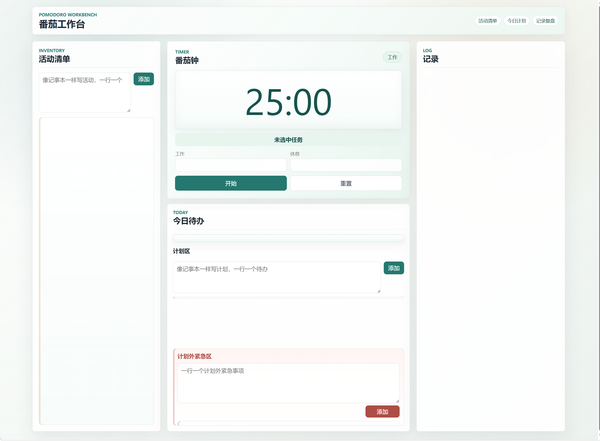
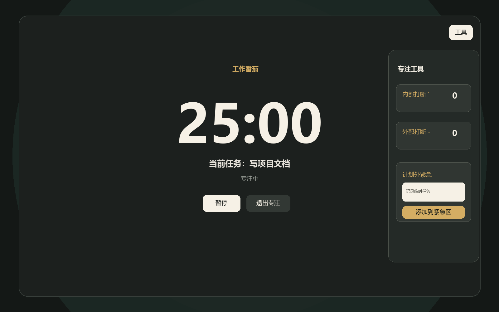

# Pomodoro Paper Workbench

<div align="center">

纸面式番茄工作法工具，把活动清单、今日待办、计划外紧急、专注计时、打断记录和每日总结放在一个轻量网页里。

[](#技术栈)
[](#数据保存)
[](LICENSE)

[在线体验](https://vaseti.github.io/pomodoro-paper-workbench/) · [功能预览](#预览) · [快速开始](#快速开始)

</div>

## 预览





## 功能

- 活动清单：像记事本一样记录所有可做事项。
- 今日待办：分为计划区和计划外紧急区。
- 估算标记：支持 `□`、`○`、`△` 三轮番茄预估，可打叉、可删除。
- 打断记录：支持内部打断 `'` 和外部打断 `-`，主界面和专注模式都可增删。
- 专注模式：启动工作番茄后隐藏主界面，只保留计时器和可收起工具栏。
- 周期控制：一个工作加休息周期结束后停止，等待手动开始下一个番茄钟。
- 每日记录：记录按天展示，保留最近三天。
- 每日总结：每天都可以写总结内容。

## 快速开始

### 在线访问

如果仓库已开启 GitHub Pages，可以直接访问：

```text
https://vaseti.github.io/pomodoro-paper-workbench/
```

### 本地运行

双击 `serve.cmd`，然后打开命令行里显示的地址。

也可以在项目目录运行：

```powershell
python -m http.server 4173 --bind 127.0.0.1
```

然后打开：

```text
http://localhost:4173/index.html?fresh=20260624-daily-records
```

## 数据保存

这个项目是 local-first 的小工具。你的活动清单、今日待办、记录和总结都保存在当前浏览器的 `localStorage` 中。

上传或分享项目代码不会包含你的个人待办、记录和总结。

## 技术栈

- HTML
- CSS
- Vanilla JavaScript ES Modules
- Browser `localStorage`
- Node.js built-in test runner

## 项目结构

```text
assets/
  screenshot-main.png
  screenshot-focus.png
src/
  app.js
  domain.js
  storage.js
  timer.js
tests/
  domain.test.mjs
  timer.test.mjs
index.html
styles.css
serve.cmd
```

## 开发验证

```powershell
node --test tests/domain.test.mjs
node --test tests/timer.test.mjs
node --check src/app.js
node --check src/domain.js
node --check src/timer.js
```

## GitHub Pages

开启方式：

1. 进入仓库 `Settings`。
2. 打开 `Pages`。
3. `Source` 选择 `Deploy from a branch`。
4. `Branch` 选择 `main`，目录选择 `/root`。
5. 保存后等待 GitHub 生成访问地址。

## Roadmap

- [ ] 支持导出每日记录。
- [ ] 支持自定义铃声。
- [ ] 支持更多专注模式背景。
- [ ] 支持 PWA 离线安装。

## License

[MIT](LICENSE)
